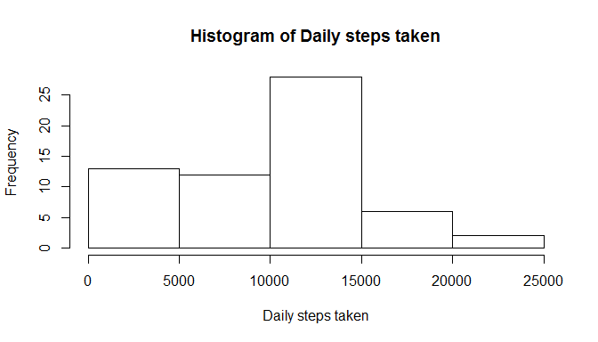
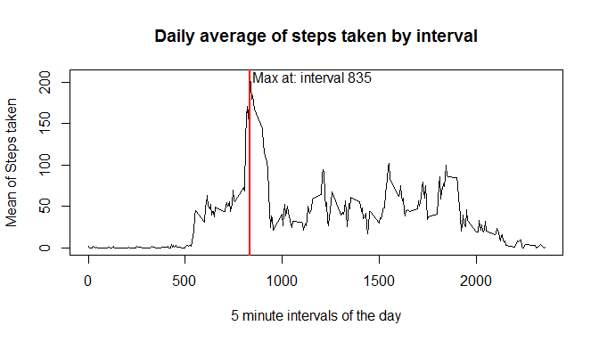
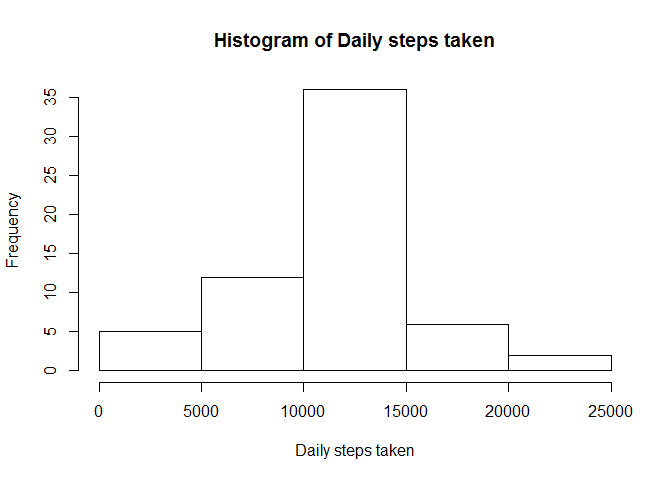
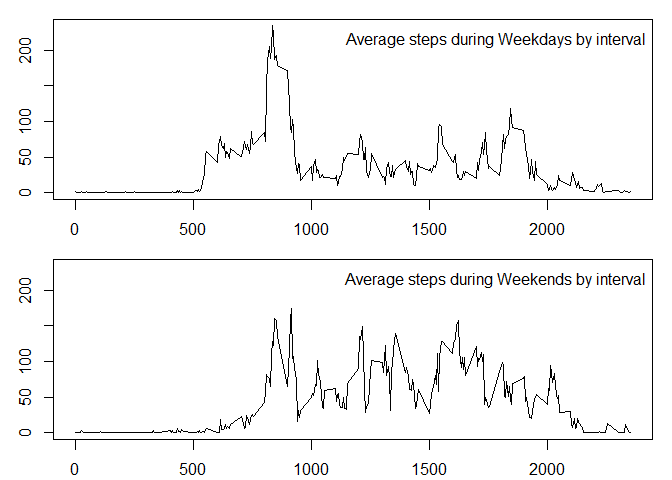

# Reproducible Research: Peer Assessment 1

We are analyzing physical activity data taken by an activity monitor at 5
minute intervals during two days from a single individual.
The data is stored in a compressed file called "activity.zip", containing a 
single `.csv` file.

The file contains three variables, and 17568 observations.
- steps: number of steps taken in the 5 minutes period recorded (missing data: NA)
- date: date of day the data was recorded
- interval: numeric representation of the period of day when the data was recorded

## Loading and preprocessing the data

We read in the csv data from the zip archive, and calculate the daily aggregates.


```r
library(data.table)
data <- read.table(unz('activity.zip', 'activity.csv'), header = TRUE, sep = ",")
data <- data.table(data)
```

## What is mean total number of steps taken per day?

We calculate sum of daily steps, and create a histogram to show distribution of
the data.


```r
library(xtable)
```

```
## Warning: package 'xtable' was built under R version 3.2.5
```

```r
summaries <- data[, list(sum = sum(steps, na.rm = TRUE)), by = date]
hist(summaries$sum, xlab = "Daily steps taken", main = "Histogram of Daily steps taken")
```

<!-- -->

```r
m_median <- median(summaries$sum)
m_mean <- mean(summaries$sum)
```

Mean of total number of daily steps taken: 9354.2295082

Median of total number of daily steps taken: 10395

## What is the average daily activity pattern?

We calculate the average of all steps taken in the 5 minute intervals across all days.
Highlight the maximum.


```r
summaries <- data[, list(mean = mean(steps, na.rm = TRUE)), by = interval]
with(summaries, plot(mean ~ interval, type = 'l', main = "Daily average of steps taken by interval", 
                ylab = "Mean of Steps taken", xlab = "5 minute intervals of the day"))
maximum <- subset(summaries, mean == max(mean))
abline(v = maximum$interval, lwd = 2, col = 'red')
text(x= maximum$interval + 320, y = maximum$mean, paste("Max at", 
                                                  paste("interval", round(maximum$interval, 0), sep = " "), sep = ": "))
```

<!-- -->

## Imputing missing values

Calculating the % of missing values in the dataset.


```r
missing_values <- is.na(data$steps)
mean(missing_values)
```

```
## [1] 0.1311475
```

We have about 13% of the steps missing. We can replace missing values with the 
daily average of the 5-minute time intervals.

Create a new dataset `data2` with the imputed values.


```r
data2 <- merge(data, summaries, by = "interval")
data2$steps <- as.numeric(data2$steps) ## coerce to numeric type from integer to allow for next step
data2[is.na(data2$steps), "cleaned.steps"] <- data2[is.na(data2$steps), mean]
data2[!is.na(data2$steps), "cleaned.steps"] <- data2[!is.na(data2$steps), steps]
## clean the extra columns
data2$steps <- NULL
data2$mean <- NULL
names(data2) <- c("interval", "date", "steps")
```

Validate impact of the changes done.


```r
summaries2 <- data2[, list(sum = sum(steps, na.rm = TRUE)), by = date]
hist(summaries2$sum, xlab = "Daily steps taken", main = "Histogram of Daily steps taken")
```

<!-- -->
The histogram shows changes in the frequency of daily steps taken, moving days from low
number of steps taken closer to the median.

```r
m_median2 <- median(summaries2$sum)
m_mean2 <- mean(summaries2$sum)
```
Mean of total number of daily steps taken: 10766 (changed from 9354)

Median of total number of daily steps taken: 10766 (changed from 10395)

Imputing missing data increased both the mean and median of the dataset, and changed 
the distribution of the dataset closer to a normal distribution.

## Are there differences in activity patterns between weekdays and weekends?

We validate whether there is a difference between steps taken during weekdays
or weekends.
We don't have details on the time zone where the data was recorded, we will assume
that weekends are Saturday and Sunday.


```r
## coerce the date column as Date
data$date <- as.Date(data$date, "%Y-%m-%d")

weekends <- c("Saturday", "Sunday")
data$date.type <- ifelse(weekdays(data$date) %in% weekends, "weekend", "weekday")
head(data)
```

```
##    steps       date interval date.type
## 1:    NA 2012-10-01        0   weekday
## 2:    NA 2012-10-01        5   weekday
## 3:    NA 2012-10-01       10   weekday
## 4:    NA 2012-10-01       15   weekday
## 5:    NA 2012-10-01       20   weekday
## 6:    NA 2012-10-01       25   weekday
```
Plot the difference in average steps taken by interval.

```r
par(mfcol = c(2, 1))
par(mar = c(2.1, 2.8, 1, 1))
summaries3 <- data[, list(mean = mean(steps, na.rm = TRUE)), by = c("interval", "date.type")]
rng <- range(summaries3$mean)
with(subset(summaries3, date.type == "weekday"), plot(mean ~ interval, type = 'l', main = "", 
                ylab = "", xlab = "", ylim = rng))
legend("topright", "Average steps during Weekdays by interval", bty = "n")

with(subset(summaries3, date.type == "weekend"), plot(mean ~ interval, type = 'l', main = "", 
                ylab = "", xlab = "", ylim = rng))
legend("topright", "Average steps during Weekends by interval", bty = "n")
```

<!-- -->
